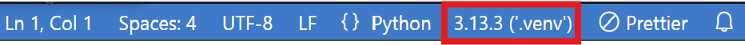

# Dodger-Game-Project
2025 GNU Object-Oriented-Programming Main Project

경상국립대학교 '객체 지향 프로그래밍' 프로젝트를 위한 Repository 입니다.

 

# 기본 설정
### Virtual Enviroments (선택사항)
 1. Terminal(`` Ctrl + ` ``)에 `python -m venv .venv` 입력
 2. venv 설치 후, 활성화 (**Activation Command** 참조)
 3. 활성화 후, `pip install -r requirements.txt` 실행
 4. 설치 후 `pip list` 명령어로 필수 패키지 설치 여부 확인
 5. 인터프리터 ('.venv')버전으로 되어있는지 확인.

 

### **Activation Command**
| Platform |    Shell   |               Command               |
|:--------:|:----------:|:-----------------------------------:|
| POSIX    | bash/zsh   | $ source <venv>/bin/activate        |
|          | fish       | $ source <venv>/bin/activate.fish   |
|          | csh/tcsh   | $ source <venv>/bin/activate.csh    |
|          | pwsh       | $ <venv>/bin/Activate.ps1           |
| Windows  | cmd.exe    | C:\> <venv>\Scripts\activate.bat    |
|          | PowerShell | PS C:\> <venv>\Scripts\Activate.ps1 |

 

# 게임 실행 방법 (2가지)
 - Terminal(`` Ctrl + ` ``)에 `python Main_Dodger.py` 또는 `python3 Main_Dodger.py` 입력
 - 프로그램 실행 버튼 클릭

 

# 개인 Branch 생성 및 제작 현황 Pull Request 하기.